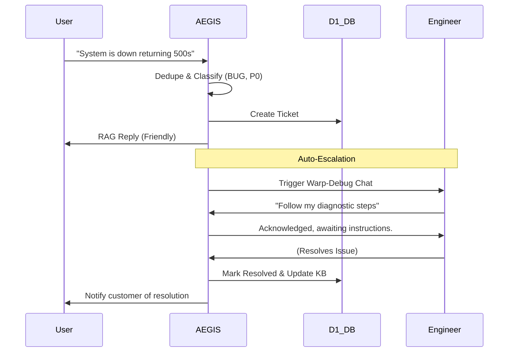

# AEGIS Autonomous Support Agent
**Project Status Report**
**Date:** April 22, 2026

## 1. Executive Summary
The AEGIS platform has been successfully modernized into a fully autonomous, AI-driven support operations system. Originally envisioned as a standard triage tool, AEGIS is now a proactive intelligence layer that intercepts, analyzes, classifies, and resolves support requests entirely independently using Google's Gemini Models, all natively deployed on Cloudflare Workers and powered by a D1 database.

## 2. Architecture & Tech Stack
The project was designed for edge deployment, ensuring zero-latency triage and high resilience.

*   **Compute:** Cloudflare Workers (`server.ts`)
*   **Database:** Cloudflare D1 (`aegis-tickets`)
*   **Intelligence:** 
    *   Primary: Google Gemini Models (`gemini-2.5-flash` for dual-chat and fast classification)
    *   Fallback: In-memory keyword-matching fallback system guaranteeing uptime during API failure.
*   **Frontend:** Vanilla JS & CSS (`ui/index.html`), hosted directly as a Worker Asset, functioning as the command-center dashboard.
*   **Integrations:** Slack (Threaded Replies, Escalation Alerts) and Notion (Knowledge Base Sync, Ticket Mirroring).

## 3. Core Features Implemented

### 🤖 Autonomous Pipeline
1.  **Ingest:** Receives support requests via dashboard / Slack events.
2.  **Dedupe:** Applies cosine-similarity matching to identify and merge duplicate support queries.
3.  **Classify:** Leverages AI to route the ticket (BUG, QUERY, FEATURE, BILLING) and assign a critical SLA priority (P0 to P3).
4.  **RAG-Reply:** Uses historical resolution data from the Knowledge Base to instantly ground a contextual response to the user.
5.  **Auto-Escalation:** Identifies P0 and P1 events and automatically pages the `#oncall-alerts` Slack channels.

### 💬 Dual-Persona Chat System
The web dashboard features a highly sophisticated dual-environment chat:
*   **User Persona:** A warm, friendly support agent that shields the user from technical jargon and handles baseline empathy and updates.
*   **Developer Persona (Warp Debug):** A specialized, highly technical agent that receives a "Snapshot" of active metrics upon escalation. It acts as an L2/L3 pairing partner, querying error logs and suggesting immediate diagnostic queries (e.g., checking Stripe webhooks, checking Redis locks).

### 📈 Dynamic Analytics
The hardcoded UI mockups have been fully replaced. The dashboard now queries the live `aegis-tickets` D1 database to produce AI-driven **Insights**, mapping exact resolution rates, ticket volume, and trend anomalies directly to the UI.

### ⏱️ Stale Ticket Chron-Job
A deployed Cron Trigger on the Cloudflare Worker routinely scans the database for tickets remaining in `open` state for more than 24 hours, automatically dispatching escalation notifications.

## 4. Workflows

## 5. Current State & Next Steps
The system is entirely decoupled from local mock data and is running correctly against the `aegis-app.shubhamvelip4.workers.dev` live worker for both API endpoints and visual rendering. 

**Future Expansion Opportunities:**
1.  **Webhook Subscriptions:** Fully wiring up Stripe / Datadog webhooks so AEGIS can ingest trace spans directly into the Warp Debug channel before a human reports the error.
2.  **Authentication:** Integrating Cloudflare Access or a lightweight JWT system so the dashboard is secured behind engineering logins.
3.  **KB Expanded Context:** Storing the generated KB summaries into a proper Vector Database (Cloudflare Vectorize) to improve the RAG pipeline's long-term intelligence as ticket volume grows.
